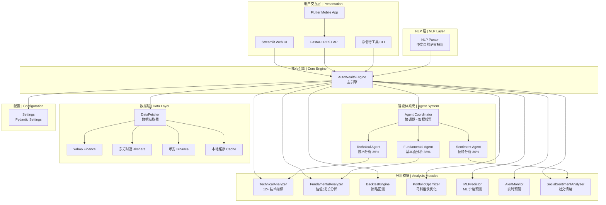

# 架构文档 | Architecture Documentation

> AutoWealth AI 系统架构设计说明。本文档描述了系统的整体架构、模块划分、数据流和技术选型。
>
> AutoWealth AI system architecture design documentation. This document describes the overall architecture, module division, data flow, and technology stack.

---

## 目录 | Table of Contents

- [系统架构概览 | System Architecture Overview](#系统架构概览--system-architecture-overview)
- [模块说明 | Module Description](#模块说明--module-description)
- [数据流 | Data Flow](#数据流--data-flow)
- [技术栈 | Technology Stack](#技术栈--technology-stack)
- [部署架构 | Deployment Architecture](#部署架构--deployment-architecture)

---

## 系统架构概览 | System Architecture Overview

### 架构图 | Architecture Diagram

```
┌─────────────────────────────────────────────────────────────────────┐
│                        用户交互层 | Presentation Layer                │
├──────────────────┬──────────────────┬───────────────────────────────┤
│  Streamlit Web   │  Flutter Mobile  │  FastAPI REST API             │
│  (examples/app.py)│  (mobile/)      │  (autowealth/api/server.py)  │
├──────────────────┴──────────────────┴───────────────────────────────┤
│                        NLP 解析层 | NLP Layer                        │
│              autowealth/nlp/parser.py (中文自然语言解析)               │
├─────────────────────────────────────────────────────────────────────┤
│                      核心引擎层 | Core Engine Layer                   │
│                  autowealth/core/engine.py (AutoWealthEngine)        │
├──────────┬──────────┬──────────┬──────────┬──────────┬─────────────┤
│ 智能体层  │ 分析层    │ 回测层    │ 优化层    │ ML层      │ 预警层      │
│ Agents   │ Analyzer │ Backtest │ Portfolio│ ML       │ Alerts      │
│          │          │          │ Optimizer│ Predictor│             │
├──────────┴──────────┴──────────┴──────────┴──────────┴─────────────┤
│                      数据获取层 | Data Fetcher Layer                  │
│              autowealth/core/data_fetcher.py                         │
│         ┌────────────┬──────────────┬──────────────┐                │
│         │ Yahoo      │ 东方财富      │ 币安          │ 本地缓存      │
│         │ Finance    │ (akshare)     │ (Binance)     │ (CSV Cache)  │
│         └────────────┴──────────────┴──────────────┘                │
├─────────────────────────────────────────────────────────────────────┤
│                      配置层 | Configuration Layer                     │
│              autowealth/config/settings.py (Pydantic Settings)       │
├─────────────────────────────────────────────────────────────────────┤
│                      情绪分析层 | Sentiment Layer                      │
│         ┌────────────┬──────────────┬──────────────┐                │
│         │ Twitter/X  │ 微博 Weibo    │ Reddit       │               │
│         └────────────┴──────────────┴──────────────┘                │
└─────────────────────────────────────────────────────────────────────┘
```

### Mermaid 架构图 | Mermaid Architecture Diagram



---

## 模块说明 | Module Description

### 项目结构 | Project Structure

```
autowealth-ai/
├── autowealth/                    # 主包 | Main package
│   ├── __init__.py               # 包初始化 | Package init
│   ├── __main__.py              # 命令行入口 | CLI entry point
│   ├── agents/                   # 智能体模块 | Agent module
│   │   ├── base_agent.py        # 基础智能体抽象类 | Base agent abstract class
│   │   ├── coordinator.py       # 智能体协调器 | Agent coordinator
│   │   ├── technical_agent.py   # 技术分析智能体 | Technical analysis agent
│   │   ├── fundamental_agent.py # 基本面分析智能体 | Fundamental analysis agent
│   │   └── sentiment_agent.py   # 情绪分析智能体 | Sentiment analysis agent
│   ├── core/                     # 核心功能 | Core functionality
│   │   ├── engine.py            # 主引擎 | Main engine
│   │   ├── data_fetcher.py      # 数据获取器 | Data fetcher
│   │   ├── analyzer.py          # 技术指标分析 | Technical analysis
│   │   ├── backtest.py           # 回测引擎 | Backtest engine
│   │   └── portfolio_optimizer.py # 组合优化 | Portfolio optimizer
│   ├── ml/                       # 机器学习 | Machine learning
│   │   └── predictor.py          # ML 预测器 | ML predictor
│   ├── nlp/                      # 自然语言 | NLP
│   │   └── parser.py             # 中文 NLP 解析器 | Chinese NLP parser
│   ├── alerts/                   # 预警系统 | Alert system
│   │   ├── monitor.py            # 预警监控器 | Alert monitor
│   │   └── notifier.py           # 通知发送器 | Notifier
│   ├── sentiment/                # 社交情绪 | Social sentiment
│   │   ├── social_analyzer.py   # 社交情绪分析器 | Social sentiment analyzer
│   │   └── dictionary.py         # 情绪词典 | Sentiment dictionary
│   ├── api/                      # Web API | Web API
│   │   └── server.py            # FastAPI 服务 | FastAPI server
│   ├── config/                   # 配置管理 | Configuration
│   │   └── settings.py           # 全局配置 | Global settings
│   ├── models/                   # 数据模型 | Data models
│   └── utils/                    # 工具函数 | Utilities
├── examples/                     # 示例代码 | Examples
│   ├── app.py                   # Streamlit 应用 | Streamlit app
│   ├── quick_start.py           # 快速入门 | Quick start
│   └── api_client.py            # API 客户端示例 | API client example
├── mobile/                       # Flutter 移动端 | Flutter mobile app
├── tests/                        # 测试 | Tests
├── docs/                         # 文档 | Documentation
├── .github/                      # GitHub 配置 | GitHub config
│   ├── ISSUE_TEMPLATE/          # Issue 模板 | Issue templates
│   └── workflows/               # CI/CD 流水线 | CI/CD pipelines
├── pyproject.toml                # 项目配置 | Project config
├── requirements.txt              # 依赖列表 | Dependencies
├── Dockerfile                    # Docker 配置 | Docker config
└── docker-compose.yml            # Docker Compose | Docker Compose
```

### 核心模块详解 | Core Module Details

#### 1. AutoWealthEngine (`core/engine.py`)

主引擎，整合所有模块的统一接口。负责协调数据获取、智能体分析、结果聚合。

Main engine that integrates all modules. Coordinates data fetching, agent analysis, and result aggregation.

**核心方法 | Key Methods:**

| 方法 | 说明 |
|------|------|
| `analyze(symbol)` | 综合分析单只股票 |
| `analyze_batch(symbols)` | 批量分析多只股票 |
| `get_market_overview()` | 获取市场概览 |
| `get_portfolio_analysis(holdings)` | 投资组合分析 |

#### 2. Agent System (`agents/`)

多智能体协作系统，采用**加权投票**机制进行决策。

Multi-agent collaboration system using **weighted voting** for decision making.

```
TechnicalAgent (35%) ──┐
                       ├── AgentCoordinator ── 加权投票 ── 最终决策
FundamentalAgent (35%) ──┤
                       │
SentimentAgent (30%) ──┘
```

**智能体权重配置 | Agent Weight Configuration:**

| 智能体 | 权重 | 分析维度 |
|--------|------|---------|
| TechnicalAgent | 35% | MACD/RSI/布林带/KDJ/均线/OBV/ATR/DMI等 |
| FundamentalAgent | 35% | PE/PB/股息率/成长性趋势 |
| SentimentAgent | 30% | 价格动量/成交量/波动率 |

**信号类型 | Signal Types:**

| 信号 | 说明 | 置信度阈值 |
|------|------|-----------|
| BUY | 买入建议 | >= 60% |
| HOLD | 观望建议 | 40% - 60% |
| SELL | 卖出建议 | >= 60% |

#### 3. DataFetcher (`core/data_fetcher.py`)

统一的数据获取接口，支持多数据源自动路由。

Unified data fetching interface with automatic multi-source routing.

```
DataFetcher
├── Yahoo Finance  ── 全球股票、ETF、指数（默认数据源）
├── 东方财富       ── A股实时数据（通过 akshare）
├── 币安           ── 加密货币交易对（自动识别）
└── 本地缓存       ── CSV 文件缓存（1小时有效期）
```

**自动路由逻辑 | Auto-routing Logic:**

- 加密货币格式（如 `BTCUSDT`） -> 币安数据源
- A股代码（如 `600519.SS`） -> Yahoo Finance / 东方财富
- 美股代码（如 `AAPL`） -> Yahoo Finance

#### 4. TechnicalAnalyzer (`core/analyzer.py`)

技术指标计算模块，支持 12+ 种技术指标。

Technical indicator calculation module supporting 12+ indicators.

| 指标 | 方法 | 说明 |
|------|------|------|
| MA | `calculate_ma()` | 移动平均线 (5/10/20/60) |
| EMA | `calculate_ema()` | 指数移动平均线 (12/26) |
| MACD | `calculate_macd()` | MACD 指标 |
| RSI | `calculate_rsi()` | 相对强弱指标 |
| Bollinger | `calculate_bollinger_bands()` | 布林带 |
| KDJ | `calculate_kdj()` | KDJ 随机指标 |
| OBV | `calculate_obv()` | 能量潮指标 |
| ATR | `calculate_atr()` | 真实波幅 |
| DMI | `calculate_dmi()` | 趋向指标 (+DI/-DI/ADX) |
| CCI | `calculate_cci()` | 顺势指标 |
| WR | `calculate_wr()` | 威廉指标 |
| PSY | `calculate_psy()` | 心理线 |

---

## 数据流 | Data Flow

### 单股分析流程 | Single Stock Analysis Flow

```
用户请求 (symbol="AAPL")
    │
    ▼
AutoWealthEngine.analyze("AAPL")
    │
    ├── 1. DataFetcher.get_stock_data("AAPL")
    │       ├── 检查本地缓存
    │       ├── 调用 Yahoo Finance API
    │       └── 返回 DataFrame (OHLCV)
    │
    ├── 2. DataFetcher.get_stock_info("AAPL")
    │       └── 返回股票基本信息 (PE/PB/市值等)
    │
    ├── 3. AgentCoordinator.analyze()
    │       ├── TechnicalAgent.analyze()
    │       │   ├── TechnicalAnalyzer.full_analysis()
    │       │   └── 生成 AgentSignal (signal_type, confidence, reasoning)
    │       │
    │       ├── FundamentalAgent.analyze()
    │       │   ├── FundamentalAnalyzer.full_fundamental_analysis()
    │       │   └── 生成 AgentSignal
    │       │
    │       ├── SentimentAgent.analyze()
    │       │   └── 生成 AgentSignal
    │       │
    │       └── _aggregate_signals()
    │           ├── 加权投票 (buy_score, sell_score, hold_score)
    │           └── 生成最终决策 (signal_type, confidence, reasoning)
    │
    └── 4. 返回分析结果
            ├── decision: 最终决策
            ├── individual_signals: 各智能体信号
            ├── technical_analysis: 技术分析详情
            ├── fundamental_analysis: 基本面分析详情
            └── stock_info: 股票基本信息
```

### 批量分析流程 | Batch Analysis Flow

```
用户请求 (symbols=["AAPL", "GOOGL", "MSFT", "AMZN"])
    │
    ▼
AutoWealthEngine.analyze_batch(symbols)
    │
    ├── 遍历每只股票，调用 analyze()
    │
    ├── 收集所有分析结果
    │
    └── 生成推荐列表
        ├── buy_signals: 按置信度排序的买入信号
        ├── sell_signals: 按置信度排序的卖出信号
        └── hold_signals: 按置信度排序的观望信号
```

### API 请求流程 | API Request Flow

```
HTTP Request
    │
    ▼
FastAPI (create_app)
    │
    ├── CORS Middleware
    │
    ├── Pydantic Model Validation (请求验证)
    │
    ├── Route Handler (路由处理)
    │   ├── /health ── 健康检查
    │   ├── /analyze ── 单股分析
    │   ├── /analyze/batch ── 批量分析
    │   ├── /portfolio/analyze ── 组合分析
    │   ├── /market/overview ── 市场概览
    │   ├── /backtest ── 策略回测
    │   └── /optimize ── 组合优化
    │
    ├── AutoWealthEngine (业务处理)
    │
    └── JSON Response (Pydantic 序列化)
```

---

## 技术栈 | Technology Stack

### 后端 | Backend

| 技术 | 版本 | 用途 |
|------|------|------|
| Python | >= 3.9 | 主开发语言 |
| FastAPI | >= 0.104 | Web API 框架 |
| Pydantic | >= 2.0 | 数据验证和序列化 |
| NumPy | >= 1.24 | 数值计算 |
| Pandas | >= 2.0 | 数据处理 |
| scikit-learn | - | 机器学习模型 |
| yfinance | >= 0.2.28 | Yahoo Finance 数据 |
| akshare | - | A股数据（可选） |

### 前端 | Frontend

| 技术 | 用途 |
|------|------|
| Streamlit | Web 可视化界面 |
| Plotly | 交互式图表 |
| Flutter | 移动端跨平台 App |
| fl_chart | Flutter 图表库 |

### 工具链 | Toolchain

| 工具 | 用途 |
|------|------|
| pytest | 单元测试 |
| black | 代码格式化 |
| flake8 | 代码风格检查 |
| mypy | 类型检查 |
| Docker | 容器化部署 |
| GitHub Actions | CI/CD |

### 数据源 | Data Sources

| 数据源 | 覆盖范围 | 接口 |
|--------|---------|------|
| Yahoo Finance | 全球股票、ETF、指数 | yfinance |
| 东方财富 | A股实时数据 | akshare |
| 币安 | 加密货币 | REST API |

---

## 部署架构 | Deployment Architecture

### 本地开发 | Local Development

```
┌──────────────────────────────────┐
│         开发者本机                │
│  ┌──────────┐  ┌──────────────┐  │
│  │ Streamlit│  │ Python CLI  │  │
│  │   App    │  │              │  │
│  └────┬─────┘  └──────┬───────┘  │
│       │               │          │
│  ┌────▼───────────────▼───────┐  │
│  │    AutoWealth Engine       │  │
│  └──────────┬────────────────┘  │
│             │                   │
│  ┌──────────▼────────────────┐  │
│  │  DataFetcher + Cache      │  │
│  └──────────┬────────────────┘  │
│             │                   │
│  ┌──────────▼────────────────┐  │
│  │  Ollama (可选本地 LLM)     │  │
│  └───────────────────────────┘  │
└──────────────────────────────────┘
```

### Docker 部署 | Docker Deployment

```bash
# 使用 Docker Compose 一键部署
docker-compose up -d

# 服务包括:
# - FastAPI API 服务 (端口 8000)
# - Streamlit Web UI (端口 8501)
```

```yaml
# docker-compose.yml 服务架构
services:
  api:
    build: .
    ports: ["8000:8000"]
    environment:
      - OPENAI_API_KEY=${OPENAI_API_KEY}
    volumes:
      - ./data/cache:/app/data/cache
```
